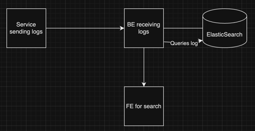

## Dy-log-or
<!-- PROJECT LOGO -->
<br />
<div align="center">
  <a href="https://github.com/hp77-creator/dylogor">
    
  </a>

<h3 align="center">Dylogor</h3>

  <p align="center">
    Dialogue with your logs 
    <br />
    <a href="https://github.com/hp77-creator/dylogor"><strong>Explore the docs »</strong></a>
    <br />
    <br />
    <a href="https://youtu.be/AK7E1y7WQ6s?si=dZppTbLIQ7kjak6J">View Demo</a>
    ·
    <a href="https://github.com/hp77-creator/dylogor/issues">Report Bug</a>
    ·
    <a href="https://github.com/hp77-creator/dylogor/issues">Request Feature</a>
  </p>
</div>

<!-- ABOUT THE PROJECT -->
## About The Project

[![Product Name Screen Shot][product-screenshot]](img/img_3.png)


Dylogor is a tool which stores logs from any microservice and 
can help you query about those logs on the basis of various fields
in the log document

<p align="right">(<a href="#readme-top">back to top</a>)</p>

## Things that are delivered at the end of submission:
- log storing capability on port 3000 
  - Using ElasticSearch to create a new index and storing document as they are inserted
  - Currently it is working for local setup
- Search functionality
  - Implemented search all
  - Search by key i.e filter
  - Search with regex
  - Search with timestamp
  - APIs were created using Flask
- Provided a CLI to the tool
  - Used Click to create a CLI
  - Information on cli is in this [README](cli/README.md)

### Prerequisites

* __ElasticSearch__
  
  Ensure that a local instance of ElasticSearch is running in the system that you are using in.
  
  You can refer [here](https://www.elastic.co/guide/en/elasticsearch/reference/current/targz.html) to install ElasticSearch. 

  Run ElasticSearch wherever you have installed the ElasticSearch
  ```shell
  ./bin/elasticsearch
  ```
* Configure [config.ini](config/config.ini) under the resource name `elastic` with your password [I have shared an example format for config.ini]
* __Flask__
  
  Install required packages after creating a virtualenv
  ```shell
  pip install -r requirements.txt
  ```
* __CLI__
  
  To use CLI tool, you will have to install it first. Please look [here](cli/README.md)


## Problem Statment 

:info: logs will be sent to port `3000`

An example of log document that is stored in Dylogor:

```json
{
	"level": "error",
	"message": "Failed to connect to DB",
    "resourceId": "server-1234",
	"timestamp": "2023-09-15T08:00:00Z",
	"traceId": "abc-xyz-123",
    "spanId": "span-456",
    "commit": "5e5342f",
    "metadata": {
        "parentResourceId": "server-0987"
    }
}
```

User should be able to query for logs on the basis of the above fields:

- `level`
- `message`
- `resourceId`
- `timestamp`
- `traceId`
- `spanId`
- `commit`
- `metadata.parentResourceId`

## Architecture

### version 1


This simple approach will give problem when we scale our system, One
scenario, given that writing to DB and Serving to FE is done by the 
same server, there may arise a condition when server might be called 
by our log-sending service and from our FE

### version 2 (Not part of this submission)


Using Kafka like streaming service to store logs and directly consuming
from there in BE can be a solution which can help us to serve multiple
users at the same time.

ElasticSearch will allow us to scale horizontally by providing more clusters
we can utilize its master-slave architecture to maintain consistency across different
clusters.

## Development

### Built With

* [![Python][Python]][Python-url]

Using `Python:3.10.13` with `pyenv` `virtualenv`


<!-- MARKDOWN LINKS & IMAGES -->
<!-- https://www.markdownguide.org/basic-syntax/#reference-style-links -->
[product-screenshot]: img/img_3.png 
[Python-url]: https://python.org/
[Python]: https://img.shields.io/badge/Python-20232A?style=for-the-badge&logo=python&logoColor=61DAFB 
